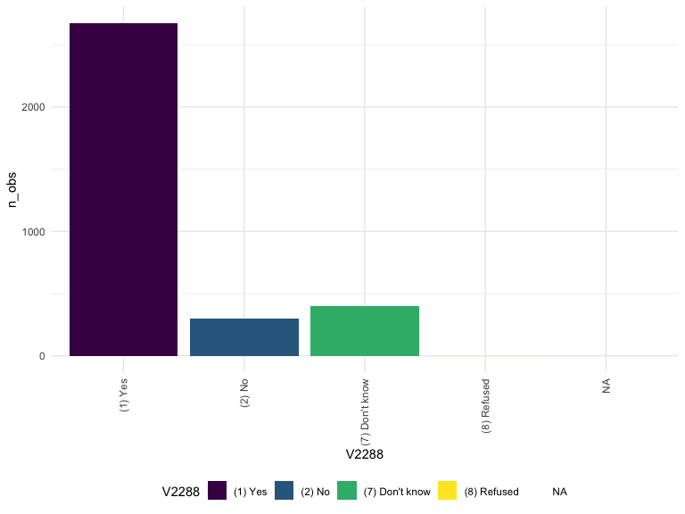
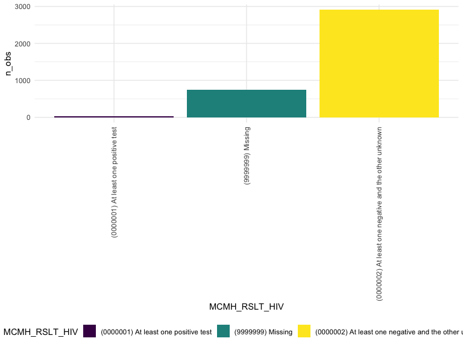
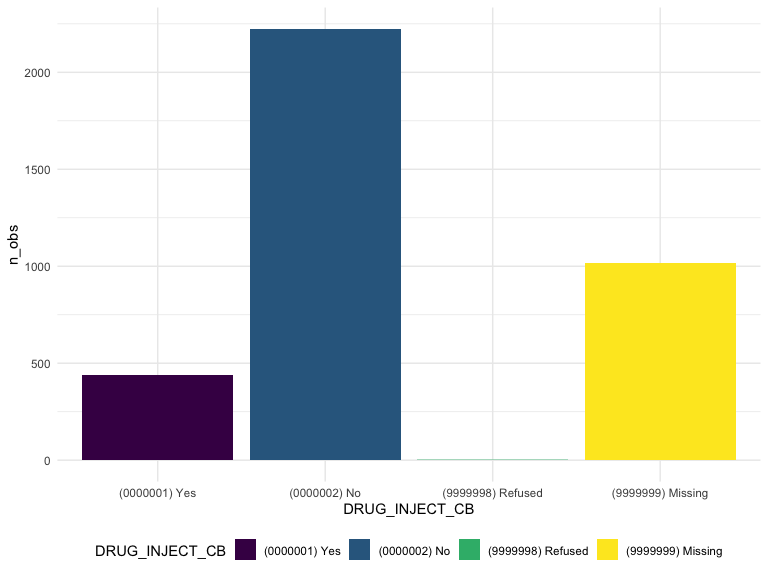
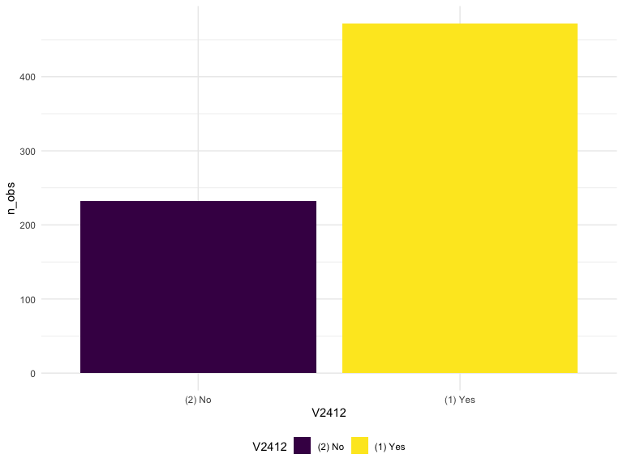
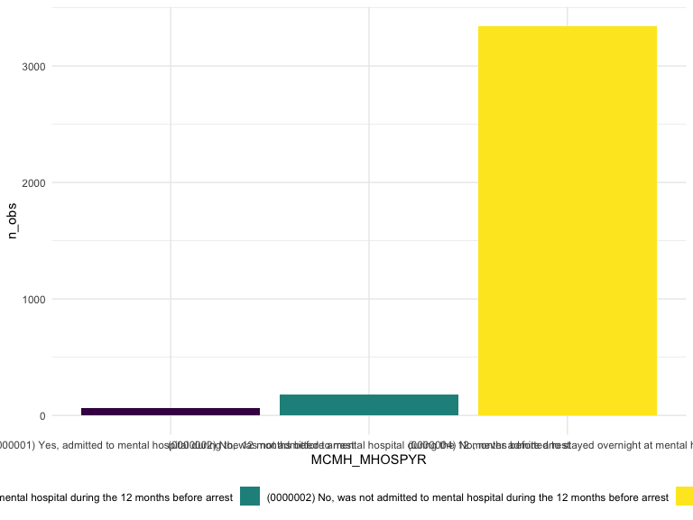
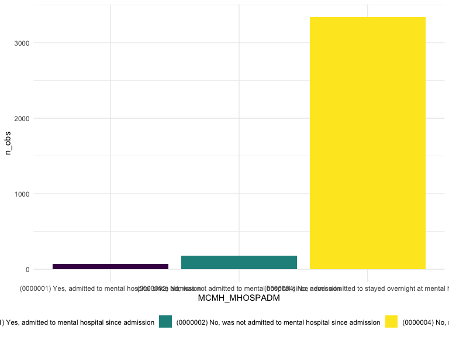

Exploratory Data Analysis
================
Allison Randy-Cofie
2022-12-01

## Importing the datasets

``` r
federal_df <- load("./data/04572-0001-Data.rda") 

federal_df <- da04572.0001%>% 
  select(V2288, V2289, V2290, V2291, MCMH_HIVTEST, MCMH_RSLT_HIV, DRUG_INJECT_CB, V2401, V2402, V2403, V2404, V2405, V2406, V2407, V2409, V2412, MCMH_MH_TREATMENT_PA, MCMH_MH_TREATMENT_AD, MCMH_MENTAL_HISTORY, V1197, CS_SENTENCEMTH,CH_PRIORSENTENCE, CH_PRIORSENTENCE_NUM, CH_CRIMHIST, CH_CRIMHIST_COLLAPSED, CH_NUMCAR,CH_NUMCAR1, CH_NUMCAR2, CH_NUMCAR3, CH_NUMCAR4, CH_NUMCAR5, MOST_SERIOUS_OFFENSE2, TYPEOFFENSE, V1056, V1057, V1060, V1061, V1325, V0001, V0014, AGE_CAT, V2982, V0005, EDUCATION, SES_INCOMEMTH, DRUG_ANY, DRUG_ANYREG, DRUG_ANYMTH, SES_PHYSSEXABUSED_EVER, SES_PARENTS_INCARCERATED, SES_FAMILY_INCARCERATED, V0105, MCMH_WHEN_DISORDER,
 MCMH_WHEN_DISORDER2,
MCMH_MHOSPYR,
MCMH_MHOSPADM,
MCMH_MHOSPYRADM,
MCMH_SMI)


state_df <- load("./data/04572-0002-Data.rda") 

state_df <- da04572.0002%>% 
  select(V2288, V2289, V2290, V2291, MCMH_HIVTEST, MCMH_RSLT_HIV, DRUG_INJECT_CB, V2401, V2402, V2403, V2404, V2405, V2406, V2407, V2409, V2412, MCMH_MH_TREATMENT_PA, MCMH_MH_TREATMENT_AD, MCMH_MENTAL_HISTORY, V1197, CS_SENTENCEMTH,CH_PRIORSENTENCE, CH_PRIORSENTENCE_NUM, CH_CRIMHIST, CH_CRIMHIST_COLLAPSED, CH_NUMCAR,CH_NUMCAR1, CH_NUMCAR2, CH_NUMCAR3, CH_NUMCAR4, CH_NUMCAR5, MOST_SERIOUS_OFFENSE2, TYPEOFFENSE, V1056, V1057, V1060, V1061, V1325, V0001, V0014, AGE_CAT, V2982, V0005, EDUCATION, SES_INCOMEMTH, DRUG_ANY, DRUG_ANYREG, DRUG_ANYMTH, SES_PHYSSEXABUSED_EVER, SES_PARENTS_INCARCERATED, SES_FAMILY_INCARCERATED, V2955)
```

``` r
#Interview outcome
da04572.0001 %>% 
  count(V0003)
```

    ##                                                                V0003    n
    ## 1                                           (201) Complete - regular 3615
    ## 2 (203) Sufficient partial interview - no further follow-up possible   71

``` r
#Sex
da04572.0001 %>% 
  count(V0004)
```

    ##        V0004    n
    ## 1   (1) Male 2728
    ## 2 (2) Female  958

``` r
#US Citizen
da04572.0001%>% 
  count(V0051)
```

    ##            V0051    n
    ## 1        (1) Yes  635
    ## 2         (2) No  118
    ## 3 (7) Don't know    4
    ## 4           <NA> 2929

``` r
#HIGHEST EDUCATION BEFORE ARREST
da04572.0001%>% 
  count(EDUCATION)
```

    ##                                                                     EDUCATION
    ## 1                      (0000000) Never attended or attended kindergarten only
    ## 2                                                       (0000001) First grade
    ## 3                                                      (0000002) Second grade
    ## 4                                                       (0000003) Third grade
    ## 5                                                      (0000004) Fourth grade
    ## 6                                                       (0000005) Fifth grade
    ## 7                                                       (0000006) Sixth grade
    ## 8                                                     (0000007) Seventh grade
    ## 9                                                      (0000008) Eighth grade
    ## 10                                                      (0000009) Ninth grade
    ## 11                                                      (0000010) Tenth grade
    ## 12                                                   (0000011) Eleventh grade
    ## 13                                                    (0000012) Twelfth grade
    ## 14                                                 (0000013) College freshman
    ## 15                                                (0000014) College sophomore
    ## 16                                                   (0000015) College junior
    ## 17                                                   (0000016) College senior
    ## 18                                         (0000017) Graduate school one year
    ## 19                                (0000018) Graduate school two or more years
    ## 20 (0000019) Attended school in other country/system not comparable to grades
    ## 21                                                       (9999997) Don't know
    ## 22                                                          (9999998) Refused
    ## 23                                                          (9999999) Missing
    ##      n
    ## 1   15
    ## 2   11
    ## 3   12
    ## 4   15
    ## 5   21
    ## 6   25
    ## 7   86
    ## 8   66
    ## 9  170
    ## 10 330
    ## 11 439
    ## 12 508
    ## 13 912
    ## 14 214
    ## 15 324
    ## 16  96
    ## 17 195
    ## 18  35
    ## 19 132
    ## 20  35
    ## 21   8
    ## 22  12
    ## 23  25

# HIV

``` r
#HIV tested
federal_df %>% 
  group_by(V2288) %>% 
  summarize(n_obs = n()) %>% 
  knitr:: kable()
```

| V2288            | n_obs |
|:-----------------|------:|
| \(1\) Yes        |  2673 |
| \(2\) No         |   298 |
| \(7\) Don’t know |   398 |
| \(8\) Refused    |     1 |
| NA               |   316 |

``` r
federal_df %>% 
  group_by( V2288) %>% 
  summarize(n_obs = n()) %>% 
  ungroup() %>% 
  ggplot(aes(x = V2288, y = n_obs, fill = V2288)) +
  theme(axis.text.x = element_text(angle = 90, vjust = .5, hjust = 1)) +
  geom_bar(stat = "identity") 
```



``` r
#HIV test result
federal_df%>% 
   group_by(MCMH_RSLT_HIV) %>%
  summarise(n_obs = n()) %>%
   mutate(
    MCMH_RSLT_HIV = fct_reorder(MCMH_RSLT_HIV, n_obs) 
  )%>% 
  ggplot(aes(x = MCMH_RSLT_HIV, y = n_obs, fill = MCMH_RSLT_HIV)) +
  theme(axis.text.x = element_text(angle = 90, vjust = .5, hjust = 1)) +
  geom_bar(stat = "identity") 
```



``` r
#Ever used a needle to inject drugs
federal_df %>% 
  group_by(DRUG_INJECT_CB) %>% 
  summarize(n_obs = n()) %>% 
  ungroup() %>% 
  ggplot(aes(x = DRUG_INJECT_CB, y = n_obs, fill = DRUG_INJECT_CB)) +
  geom_bar(stat = "identity") 
```



\#Mental Health

``` r
#ever taken a medication for mental health 
federal_df %>% 
  group_by(V2409) %>% 
  summarize(n_obs = n()) %>% 
  knitr:: kable()
```

| V2409            | n_obs |
|:-----------------|------:|
| \(1\) Yes        |   704 |
| \(2\) No         |  2887 |
| \(7\) Don’t know |     9 |
| \(8\) Refused    |    30 |
| NA               |    56 |

``` r
federal_df %>% 
  group_by(V2409) %>% 
  summarize(n_obs = n()) %>% 
   mutate(
    V2409 = fct_reorder(V2409, n_obs)) %>% 
  ungroup() %>% 
  ggplot(aes(x = V2409, y = n_obs, fill = V2409)) +
  geom_bar(stat = "identity")
```


``` r
# TAKEN MEDICATION FOR A MENTAL CONDITION SINCE ADMISSION
federal_df %>% 
  group_by(V2412) %>% 
  summarize(n_obs = n()) %>% 
  knitr:: kable()
```

| V2412     | n_obs |
|:----------|------:|
| \(1\) Yes |   472 |
| \(2\) No  |   232 |
| NA        |  2982 |

``` r
federal_df %>% 
  group_by(V2412) %>% 
  summarize(n_obs = n()) %>% 
  drop_na() %>% 
   mutate(
    V2412 = fct_reorder(V2412, n_obs)) %>% 
  ungroup() %>% 
  ggplot(aes(x = V2412, y = n_obs, fill = V2412)) +
  geom_bar(stat = "identity")
```



``` r
# Mental Hosp - year before arrest - MCMH_mhospyr from client
federal_df %>% 
  group_by(MCMH_MHOSPYR) %>% 
  summarize(n_obs = n()) %>% 
  knitr:: kable()
```

| MCMH_MHOSPYR                                                                           | n_obs |
|:---------------------------------------------------------------------------------------|------:|
| \(0000001\) Yes, admitted to mental hospital during the 12 months before arrest        |    67 |
| \(0000002\) No, was not admitted to mental hospital during the 12 months before arrest |   179 |
| \(0000004\) No, never admitted to stayed overnight at mental hospital                  |  3343 |
| \(9999998\) DK/refused                                                                 |    41 |
| \(9999999\) Missing                                                                    |    56 |

``` r
federal_df %>% 
  group_by(MCMH_MHOSPYR) %>% 
  summarize(n_obs = n()) %>% 
  filter(MCMH_MHOSPYR %in% c("(0000004) No, never admitted to stayed overnight at mental hospital","(0000001) Yes, admitted to mental hospital during the 12 months before arrest",
  "(0000002) No, was not admitted to mental hospital during the 12 months before arrest")) %>% 
  drop_na() %>% 
   mutate(
    MCMH_MHOSPYR = fct_reorder(MCMH_MHOSPYR, n_obs)) %>% 
  ungroup() %>% 
  ggplot(aes(x = MCMH_MHOSPYR, y = n_obs, fill = MCMH_MHOSPYR)) +
  geom_bar(stat = "identity")
```



``` r
# Mental hosp - since admission - MCMH_mhospadm from client
federal_df %>% 
  group_by(MCMH_MHOSPADM) %>% 
  summarize(n_obs = n()) %>% 
  knitr:: kable()
```

| MCMH_MHOSPADM                                                         | n_obs |
|:----------------------------------------------------------------------|------:|
| \(0000001\) Yes, admitted to mental hospital since admission          |    69 |
| \(0000002\) No, was not admitted to mental hospital since admission   |   178 |
| \(0000004\) No, never admitted to stayed overnight at mental hospital |  3343 |
| \(9999998\) DK/refused                                                |    40 |
| \(9999999\) Missing                                                   |    56 |

``` r
federal_df %>% 
  group_by(MCMH_MHOSPADM) %>% 
  summarize(n_obs = n()) %>% 
    filter(!MCMH_MHOSPADM %in% c("(9999999) Missing","(9999998) DK/refused")) %>% 
  drop_na() %>% 
   mutate(
    MCMH_MHOSPADM = fct_reorder(MCMH_MHOSPADM, n_obs)) %>% 
  ungroup() %>% 
  ggplot(aes(x = MCMH_MHOSPADM, y = n_obs, fill = MCMH_MHOSPADM)) +
  geom_bar(stat = "identity")
```


